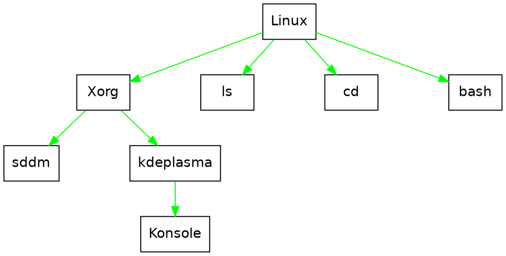

Choisir une distribution Linux qui correspond à ses besoins
===

# Introduction

:::warning
:warning: Toute cette petite introduction n'est que pour en apprendre un peu plus sur ce qu'est Linux et n'est absolument pas nécessaire pour lire [la suite du tuto](#Les-environnements-de-bureau)
:::

::: info
:dark_sunglasses: De manière générale, si vous voulez aller encore plus vite et ne même pas lire ce tuto, **[ce site](https://distrochooser.de/fr/)** est fait pour vous!
:::

Le monde de Linux est immense, et nombreux sont ceux qui n'en ont plus jamais décroché après y avoir goûté. Il trouve ses racine dans les premiers pas des hackers du MIT des années 50 qui s'introduisaient la nuit dans les laboratoires de l'université pour y coder ce qui leur passait par la tête et non y faire tourner d'interminables autant qu'ennuyeuses simulations. Ce sont eux qui ont placé les bases de **[L'éthique des hackers](https://fr.wikipedia.org/wiki/L'%C3%89thique_des_hackers)** et de **l'open source**, c'est à dire une philosophie de l'informatique comme une fin en soi, ouverte à tous.

## Mais dis donc Jamy, qu'est-ce que c'est l'Open Source?

L'open source, désigne les logiciels soumis à des licences qui stipulent que le code de ces derniers doit être accessible à tous. Il y en a de nombreuses différentes, comme la licence **BSD** qui autorise à ce que le code soit utilisé à des fins commerciales (Parmis les exemples célèbres, on trouve le kernel BSD qui est utilisé comme base notamment à **MacOS** et **Playsation 4 system software**, eh oui ces deux là partagent pas mal de choses!), mais la plus connue est la licence **GPL** qui stipule que toute modification du code source doit être elle aussi publiée sous licence GPL. C'est sous cette licence qu'est publié le kernel Linux, et ce qui fait que l'écosystème autour de celui-ci est si étendu.

## C'est quoi un "kernel"?

En fait, il se trouve que lorsque quelqu'un est _sous Linux_, il n'y a pas **que** Linux sur son ordinateur. Pour pouvoir utiliser son ordinateur normalement, il faut installer tout un ensemble de programmes auxquels Linux va servir de socle. 

Par exemple un programme pour afficher des choses à l'écran (eh oui, Linux ne sait pas faire ça tout seul!) comme **X.org** ou **Wayland**, un programme pour gérer les fenêtres, les faires passer de l'arrière plan au premier plan et inversement, etc. Et le côté merveilleux de tout ça, c'est que comme la plupart de ces programmes sont open source, chacun est libre de le modifier à se guise pour y créer une alternative. En fait, chaque programme a souvent des dizaines d'alternatives. Et les ensembles cohérents de programmes sont appelés des **distribution**, dont Linux n'est que la base, le noyau, d'où le terme de **kernel**.

## Il y a beaucoup de distributions?

Oui. Vraiment. Parce que tout le monde peut faire sa distribution avec un peu de motivation.

Alors comment tirer son épingle du jeu dans tout ça? Vous tombez bien, c'est ce dont on va parler ici! On va se concentrer sur les plus connues, que je vais essayer de vous présenter succintement.

---

# Les environnements de bureau

Avant de se lancer dans le choix à proprement parler, il **faut** évoquer rapidement les environnements de bureau (ou *DE*, pour *Desktop Environment*).

Un environnement de bureau, c'est le programme qui va gérer *en très très gros* le look global de votre environnement de travail. Il y en a des dizaines, certains plus personnalisables que d'autres, certains plus coûteux en ressources que d'autres. Comme les distributions viennent généralement avec plusieurs environnements de bureau différents, qu'on appelle des *flavours*, à choisir au moment de télécharger l'ISO. Il est donc important de savoir un peu de quoi on parle avant.

:::success
Il ne faut cependant pas oublier que sous Linux, **tout est 100 % personnalisable**, que les options de chaque DE sont nombreuses, et que dans l'absolu, si quelque chose vous manque, vous pourrez toujours ajouter un plugin ou aller trafiquer 3 lignes de code vous même. L'apparence des DE n'est donc jamais fixe, et si chaque distribution vient avec son propre thème, vous pouvez **toujours** le personnaliser. Les images que vous verrez dans cette secton sont des exemples de thèmes très poussés extraits de **[cette page](https://www.reddit.com/r/unixporn/)**, où vous pourrez constater tout ce qui est faisable avec les différents DE.
:::

## Les environnements "riches"

Certains environnements proposent des fonctionnalités multiples, débordent d'animations, et peuvent rapidement peser lourd sur la RAM des petites config. En contrepartie, il y a tout le confort, et certains tiennent presque plus de la distribution complète que de l'environnement de bureau. Les exemples les plus notables sont:

---

### GNOME

C'est la *flavour* par défaut d'Ubuntu. Le projet GNOME est l'un de ceux avec les partis pris les plus forts, ce qui lui donne une vraie personnalité. En revanche, il demandera un petit temps d'adaptation pour apprendre les bonnes pratiques (par exemple, l'impossibilité de créer des raccourcis sur le bureau peut être perturbant). Le système d'ajout d'extensions par navigateur est assez contre intuitif au premier abord, mais quand on s'y est fait, c'est l'un des points forts de l'environnement. Il est assez facile à naviguer, en revanche, étant un des DE lourds, il vient souvent avec distributions chargées de plein de logiciels dont on aura pas nécessairement l'utilité, et qu'il sera difficile de faire disparaître du menu d'accueil si on le souhaite!
En résumé, c'est un DE riche qui offre une expérience polie, mais qui demandera un certain temps d'adaptation et quelques compromis.

*Credit: u/Mykol225*

---

### KDE

C'est un DE qui emprunte beaucoup aux paradigmes de Windows. Un utilisateur de ce dernier s'y retrouvera facilement. En plus d'un environnement familier, KDE fonctionne avec des widgets qui permettent d'enrichir l'expérience de l'utilisateur, comme une horloge, des capteurs de performances système et autre. KDE est un DE qui vise avant tout la personnalisation. dans tout les paramètres d'apparence, il est proposé de télécharger des alternatives. Mais il faut cependant s'y prendre avec modération, parce qu'on se retrouve facilement avec un bureau qui ne ressemble plus à rien à force de rajouter et modifier les composants graphiques.
Il a l'avantage d'ailleurs d'être plutôt "léger parmis les lourds", car l'équipe du projet KDE s'efforce de le modérer dans son utilisation de RAM.
En résumé, si vous voulez une expérience qui s'approche du bureau Windows, mais 100% personnalisable, vous êtes au bon endroit.

*Credit: u/BeerBellyPete*

---

### Cinnamon

C'est un DE qui a été créé spécialement pour **Linux Mint**, mais qui est devenu si populaire qu'il a été porté sur de nombreuses distributions. Moins personnalisable que **KDE**, il vient avec un thème sobre et efficace, qui emprunte là aussi aux paradigmes de Windows. C'est un dérivé (mais très très dérivé) de GNOME, donc les applications compatibles avec l'un sont compatibles avec l'autre notamment au niveau des thèmes (là où des applications designées pour KDE feraient tache par exemple)
Si vous venez de Windows et que vous voulez un coup de frais sans être dépaysé, Cinnamon est pour vous.

*Credit: u/chaNcharge*

---

:::info
Il existe en fait 2 framework (c'est à dire des librairies qui vont gérer l'affichage des boutons, de la minimisation, maximisation ET l'intégration au thème global de la distribution, pour éviter d'avoir à réinventer la roue à chaque nouveau programme) principaux dans l'affichage de fenêtres sous Linux: **GTK** (porté notamment par GNOME) et **Qt** (porté notamment par KDE). S'il y a de nombreux efforts mis en place pour que l'intégration d'applis codées pour l'un se fasse bien sur l'autre, il faut garder en tête que ce ne sera évidemment pas parfait, surtout les applications Qt dans un DE qui utilise GTK
:::

### Budgie

Créé de toute pièce pour le projet **Solus**, Budgie est un environnement de bureau qui a su tirer son épingle du jeu avec son apparence élégante et simple. On retiendra notamment son volet de notifications avec le calendrier qui permet de vérifier en un coup d'oeil ses rendez-vous de la journée et les derniers mails reçus. Pas particulièrement lourd, il ne se revendique cependant pas léger, d'où sa présence dans cette section.

*Credit: u/phandungtri*

---

:::info
Les connaisseurs remarqueront que je n'ai pas parlé de **Deepin DE**. C'est parce qu'il me semble gourmand en performances pour pas grand chose, et qu'il n'apporte pas grand chose par rapport aux autres...
:::

## Les environnements légers

Si on peut tirer une expérience infiniment riche sur des grosses config, il ne faut pas oublier que Linux se vante d'être un système d'exploitation léger qui tourne même sur des grilles-pains. Il existe donc de nombreux DE plus légers les uns que les autres, qui pourraient permettre à la vieille bécane de mamie Jacqueline de servir à nouveau au moins pour du traitement de texte et de la bureautique, sans avoir à attendre 1h30 que Windows 95 et MS Word se lancent.

:::warning
Marre des 20 Go de Windows 10? Il existe des distributions qui arrivent à proposer une interface graphique avec 12 Mo de RAM. [Sisi](http://www.tinycorelinux.net/).
:::

Si votre ordi n'est pas un foudre de guerre, mais que vous voulez installer Linux dessus, il est fait pour! Cependant, il vaudrait mieux privilégier l'un des DE suivants:

### XFCE

On commence par celui-là, parce que c'est la star des DE légers. Il arrive à proposer des animations,de nombreuses personnalisations possibles, tout en étant bien plus léger que les mastodontes dont on a parlé plus haut. 
En fait, il est si fonctionnel qu'il est le choix par défaut de nombreuses distributions, et l'une des *flavours* "légère" de beaucoup d'autres.
Si vous voulez avoir une expérience utilisateur complète sans pour autant peser trop sur votre RAM, XFCE est pour vous.

*Credit: u/VeryConciousWater*

---

### Mate

Avec un environnement qui n'est pas sans rappeler les années 2000, il ne faut pas sous estimer Mate qui arrive avec un set de personnalisations non négligeable. A peine plus lourd qu'XFCE, son set d'applications propres est simple et intuitif. L'économie de ressources est là et ça se sent, mais sans pour autant entacher l'expérience utilisateur qui reste fluide.
Si vous êtes un peu nostalgique de l'époque de Windows XP, et que vous cherchez un DE qui saura se faire discret pour ne pas perturber votre concentration par des options trop compliquées, vous avez frappé à la bonne porte.

*Credit: u/LuvPastelPink*

---

### LXQt

Là on arrive dans les DE vraiment très légers, pour les toutes petites config. Au revoir les animations, adieu les customisations multiples, bienvenue sur LXQt. Le tour de force de ce DE, est que chaque sacrifice au niveau de l'expérience utilisateur *visuelle* se traduit par un gain de performance solide. Et si vous n'êtes pas très portés sur la personnalisation, c'est pas très grave parce que LXQt arrive déjà tout bien codé pour avoir un look tout à fait acceptable.
Si la customisation c'est pas votre truc et que votre bécane est plus proche du ventilateur que du supercalculateur, lancez vous sur LXQt, vous verrez que Linux, ça tourne vraiment sur rien.

*Credit: u/yfph*

---

## Et les gestionnaires de fenêtre dans tout ça?

Alors là on touche aux utilisateurs qui n'ont pas peur de se lancer des défis technique. Il se trouve que sur Linux, on est pas vraiement obligé d'avoir un DE pour l'utiliser, certains se contentent de gestionnaires de fenêtres (Ou Window Manager, raccourcis en WM). Ce sont des programmes fait pour être utilisés uniquement au clavier, et qui sont extrêmement légers faits pour privilégier la concentration et l'efficacité, le *workflow* quoi. En contrepartie demandent un certain temps d'apprentissage. Si vous êtes un *hardcore coder* et que vous voulez être toujours plus performant, je vous invite à vous renseigner par vous même (i3wm, openbox, icewm...), le choix est immense, mais je ne vais pas l'aborder ici.

## Si je viens de MacOS, comment je m'y retrouve dans tout ça?

Beaucoup de DE utilisent le paradigme de bureau de Windows, mais certains s'inspirent aussi de MacOS, comme Pantheon par exemple. Cependant si par "comment je m'y retrouve?", vous entendez "elle est où ma barre de raccourcis en bas de l'écran?", sachez qu'il existe le package `latte-dock` qui vous permet d'ajouter une *dock bar* facilement sur quasiment tout les DE et distributions.

:::info
:hammer_and_wrench:  De manière générale, si vous souhaitez ajouter n'importe quoi, par exemple un composant graphique comme une barre de recherche sur votre bureau, cherchez un peu sur Google, il y aura forcément un package pour le faire
:::

## Pour conclure sur les DE

Vous l'aurez compris, l'apparence d'une distribution est plus liée au DE que vous choisissez d'utiliser qu'à la distribution en elle même. Sachez d'ailleurs que vous pouvez toujours changer de DE assez facilement une fois votre distribution installée. Cependant, il faudra avoir la patience de tout re-personnaliser pour retrouver une expérience cohérente. C'est faisable, mais je vous suggère de choisir le bon DE dès le début, ça vous fera gagner pas mal de temps.

# Bon, on les choisis ces distributions?

Oui, oui, on y vient. Comme vous l'avez vu au dessus, il existe des centaines de distributions différentes. On va donc se concentrer sur les distributions "majeures", et passer en revue leurs avantages et inconvénients. Sachez aussi que je vais essayer de me concentrer sur les distributions ayant un écosystème de logiciels cohérent suffisant pour ne pas risquer d'entacher  votre expérience utilisateur parce que vos logiciels favoris n'existent pas dessus (eh oui, j'aurais bien aimé parler de *Solus Project*, mais malheureusement c'est un peu trop niche...).

## Les gestionnaires de paquets

Promis, c'est la dernière appartée avant le choix des distros, mais il faut absolument l'évoquer. En effet, une distribution vient avec un ensemble de logiciel cohérent, mais elle ne va pas **tout** installer d'un coup sur votre ordi, ça serait idiot. C'est pourquoi toutes les distributions viennent avec ce qu'on appelle un gestionnaire de paquets (Package manager), qui va gérer tout les téléchargement et installation de logiciels, s'assurer que chaque petit nouveau est bien installé sur votre ordinateur avec tout les sous programmes nécessaires à son bon fonctionnement etc. En effet, le système de *logithèque*, qu'on retrouve aujourd'hui dans nos téléphones, que ça soit le Playstore ou l'Apple store, existe depuis les années 90 sur Linux. Ca permet à chaque distribution de ne proposer **que** des logiciels qui sont compatibles et certifiés sans failles de sécurité. Un package manager est donc l'épine dorsale d'une distro, et ne peut être changé. C'est pourquoi l'écosystème de logiciels disponible sur une distribution est intimement lié à son package manager, et que les distributions avec des packages managers un peu exotiques peinent à émerger. Ceci étant dit, choisissons notre distro.

## Les distributions "de base"

Et par "de base", je ne veux pas dire qu'elles soient basique, bien au contraire, mais plutôt qu'elles sont tellement travaillées et réussies que d'autres distributions ont décidé de se baser dessus pour créer les leurs. On va donc évoquer ici les distributions qui sont en quelque sorte le fondement de l'univers Linux.

### Ubuntu

Commment ne pas commencer par celle-ci? J'aurais pu ne même pas la mettre dans cette section, puisqu'elle est elle même basée sur Debian, mais elle a tellement de succès que de nombreuses distro s'en sont servies comme d'un tremplin. C'est la distro du débutant par excellence, dès que vous avez un problème sur Linux, si la solution existe, elle existe pour Ubuntu. Elle est construite autour du package manager de Debian, comme tout ses dérivés, vous le connaissez sans doute si vous avez déjà fait une install Linux: `apt`.
La distribution fonctionne sur un cycle de mise à jour tout les deux ans, et entre ne sont appliquées que des mises à jours mineures et des patchs de sécurités. C'est probablement **la** distribution qui vient avec le plus de *flavors*. Tout les DE dont j'ai parlés précédemment sont proposés, et bien d'autres encore. Par défaut, sur le site d'Ubuntu vous trouverez l'ISO avec GNOME dessus, et pour trouver les autres *flavors*, il faudra généralement googler *première lettre du DE de votre choix* + "ubuntu" (par exemple "Kubuntu" pour KDE, "Xubuntu" pour XFCE etc).
Choisir Ubuntu, c'est choisir la stabilité, avec un catalogue de logiciels immense et des tutos partout.
Il faut cependant se méfier d'une chose: si vous êtes un bidouilleur qui va vouloir se tenir au courant des dernières sorties logicielles, vous allez potentiellement vouloir agandir votre logithèque en y ajoutant des `ppa`. C'est là que vos ennuis avec `apt` risquent de commencer: `apt` est fait pour fonctionner avec les logiciels de la version courante d'Ubuntu. Si les logiciels de vos `ppa` nécessitent d'autres versions, vous aller sombrer dans **l'enfer des dépendances**, où `apt` va se retrouver tout perdu et ne plus rien vouloir installer, et votre install sera cassée, bravo, bienvenue dans le monde du bidouillage Linux.
Ubuntu est donc la distribution de choix si vous souhaitez un usage bien sage et bien stable de Linux, pour lequel vous acceptez de rester dans le cadre qui vous est imposé. Parfait pour les débutants et les utilisateurs occasionnels, ou tout simplement ceux qui ne veulent pas se poser de questions à chaque démarrage de leur ordinateur.

*Ubuntu avec GNOME*

:::    success
:floppy_disk: Télécharger **[Ubuntu](https://ubuntu.com/download/desktop)**
:::

:::info
Si vous cherchez à installer un logiciel qui n'est pas dans les dépôts officiels pour Ubuntu ou Debian, je vous suggère de commencer par vous renseigner sur **Flatpak** et **Snapcraft** avant d'ajouter des `ppa`
:::

---

### Debian

Pourquoi ne pas avoir commencé par Debian? C'est pourtant une distribution fondatrice, un mastodonte du logiciel libre, sur lequel même Ubuntu est basé! Eh bien c'est parce que Debian, plus qu'une distribution, c'est une philosophie de vie. Debian se targue de n'utiliser que des logiciels entièrement open source, et donc de refuser tout ce qui a été codé pour Linux mais ne diffuse pas ses sources. C'est une belle philosophie, et [Wikipédia](https://fr.wikipedia.org/wiki/Debian#Caract%C3%A9ristiques_de_la_philosophie_Debian) vous en parlera bien mieux que moi. Le résultat d'un parti pris aussi fort, cependant, c'est que beaucoup de logiciels vont nécessiter l'ajout de `ppa`, et croyez moi, vous préférez éviter au maximum. En revanche, une autre des facettes de Debian, c'est son focus sur la stabilité et son support *ad vitam eternam*. En effet, l'équipe de développement met un point d'honneur à ce que tout marche parfaitement bien, quitte à prendre un retard parfois énorme sur les mises à jour de logiciels.
Quasiment tout les DE sont disponibles sous Debian, une bonne partie de ceux cités ci-dessus peuvent être choisis **lors de l'installation** (et non au moment de télécharger l'ISO).
En bref, Debian c'est le choix de la stabilité éternelle, à condition de ne pas vouloir de logiciels trop nouveaux.

*Debian avec Cinnamon*

:::    success
:floppy_disk: Télécharger **[Debian](https://www.debian.org/distrib/)**
:::

---

### Arch Linux

Alors ça, c'est pas du tout une distribution de débutants. La convivialité ? Ils l'ont mangée, dommage. Cette distribution s'intalle manuellement, en ligne de commande, donc si vous n'avez jamais partitionné vos disques en *tty*, passez votre chemin. Mais pourquoi en parler alors? Parce que Arch Linux utilise comme gestionnaire de paquets `pacman`, et qu'elle fonctionne en rolling release, c'est à dire qu'il n'y a pas de version 1, 2 ou 3: tout vos logiciels sont mis à jours quotidiennement quasiment. Ça confère à Arch une force immense car vous pouvez utiliser ses programmes à la minute de leur sortie, mais c'est aussi sa faiblesse car parfois certains paquets peinent à suivre le rythme de mise à jour, finissent obsolète et votre distro se retrouve HS. Honnêtement, si vous avez réussi à installer Arch, ça va pas vous faire peur de passer quelque temps en console pour réparer tout ça, mais à la longue ça peut devenir usant.
Mais cette nature de distribution 'de geek' fait qu'il y a un wiki immense qui a réponse à toute vos questions sur Linux, et que si un de vos programmes favoris n'est pas encore dans les dépôts officiels, il sera forcément déjà dans un `AUR`, l'équivalent des `ppa` sous Arch, à la différence près que les paquets mis à jours continuellement vous évitent de tomber dans **l'enfer des dépendances**...
C'est donc une distribution à éviter pour les débutants, bien que les tutos soient si bien faits que n'importe qui pourrait réussir à l'installer avec un peu de patience et d'huile de coude.
En revanche, l'installer vous fera monter une grosse marche dans votre compréhension de Linux. Et vous pourrez alors dire le fameux "I use Arch btw", qu'on voit fleurir sur les subreddits Linux.
Tout les DE sont disponibles sur Arch, par contre il vous faudra les installer a la main, et être prêt à les personnaliser à votre convenance, car ils seront dans leurs versions *vanilla*, c'est à dire sans personnalisation.
En bref, c'est une distribution de connaisseur,qui vous apprendra beaucoup sur Linux, et pour laquelle **tous** les logiciels Linux existants seront disponible, au prix d'un petit surplus de travail de temps en temps. 

*Arch Linux avec KDE*

:::    success
:floppy_disk: Télécharger **[Arch Linux](https://archlinux.org/download/)**
:::

---

### RHEL

La dernière des 'Grandes', ce n'est pas vraiment une distribution que vous pourrez essayer, puisqu'elle est destinée aux entreprises. En revanche, beaucoup de distributions sont basées dessus. C'est une distribution conçue par la **Red Hat Enterprise**, qui propose une version facilement déployable sur de nombreuses machines simultanément, facilement mise à jour à grande échelle etc. Etant financée par une entreprise, entretenur par des développeurs à plein temps, qui ajoutent continuellement des fonctionnalités en fonction des besoins des entreprises. Les ajouts majeurs sont souvent portés plus tard aux autre distributions, ce qui fait que certains la considèrent comme une vitrine sur le futur du logiciel libre.
Elle est construite autour du gestionnaire de paquet `rpm` qui fonctionne de manière similaire à `apt`.
Ce n'est donc pas une distribution que vous pourrez tester directement, en revanche vous serez peut être amenés à travailler avec, et certaines distributions intéressanes sont basées dessus.

:::danger
:cry: Eh non, elle ne se télécharge pas celle-là...
:::

## Les distributions "basées"

Ces distributions sont les grands noms basés sur celles que l'on a vu précédemment. Elles apportent chacunes leur lot de nouveautés, d'avantages et parfois d'inconvénients. L'intérêt étant que tout tutoriel fonctionnant sur la distribution sur laquelle elle est basée pourra être utilisé. Voici donc une liste non exhaustive des distributions les plus connues:

### Linux Mint

Il fallait commencer par celle-ci: elle est recommandée à tout les débutants passant à Linux et ne voulant pas être trop dépaysés. Elle vient avec un certain nombre de package de compatibilité avec des formats de donnée propriétaire. Traduction: vous pourrez ouvrir tout vos fichiers dessus. On la trouve sous trois versions principales: **Cinnamon**, **Mate** et **XFCE**. Vous pourrez donc choisir ce qui conviendra à votre config, chaque version étant lourdement personnalisée par l'équipe Linux Mint, pour offrir une expérience agréable et facile d'accès. Elle est basée sur Ubuntu, ce qui lui donne accès tout son écosystème.
On pourrait la réduire à une version d'Ubuntu spécialement conçue pour accueillir les nouveaux venus sur Linux, mais l'ensemble des logiciels pré-installés en font bien plus que ça: une expérience stable et agréable, un environnement de travail agréable et tout les logiciels dont vous aurez besoin.

*Linux Mint avec Cinnamon*

:::    success
:floppy_disk: Télécharger **[Linux Mint](https://linuxmint.com/download.php)**
:::

---

### Fedora

Une valeur sûre: le choix de prédilection de **Linus Thorvald**, le créateur de Linux. Fedora est basée sur **RHEL**, mais mieux encore, elle est *upstream*, c'est à dire que c'est la distribution créée par **Red Hat Enterprise** pour tester ses innovations avant de les implémenter dans RHEL. En quelque sorte, en utilisant Fedora, vous devenez bêta-testeur pour Red Hat Enterprise, et en contrepartie vous avez accès en avant première aux innovations majeures qui seront implémentées dans un futur proche dans les autres distributions.
Mais RHEL étant une version pour entreprise, ils doivent pouvoir proposer une expérience à la fois stable **ET** à jour sur les sorties des différents logiciels. C'est donc une distribution idéale pour développeur, car les risques de plantage sont faibles, et les logiciels, framework et autres sont à jour avec un délai d'au plus 6 mois.
Fedora n'est disponible qu'avec **GNOME** officiellement, mais il est facile de trouver d'autres *flavours* supportées par la communauté (appelées *spins*) [ici](https://spins.fedoraproject.org/fr/).
Si vous développez, notamment du web, que vous recherchez une expérience stable et que vous n'êtes pas très féru de personnalisation, Fedora sera votre choix.

*Fedora avec GNOME*

:::    success
:floppy_disk: Télécharger **[Fedora](https://getfedora.org/fr/workstation/download/)**
:::

---

### Pop!\_Os

Toujours dans la lignée des distributions stables, on trouve Pop!\_OS. C'est une distribution qui se veut orientée vers les créateurs, mais c'est avant tout une expérience utilisateur soigneusement léchée, et faite pour vous dépayser par son originalité, tout en sachant s'effacer quand il faut pour ne pas perturber votre travail. 
Elle est basée sur Ubuntu pour une compatibilité maximale, et es livrée avec son propre DE, COSMIC, version de GNOME lourdement modifiée pour pouvoir élargire les possibilités de personalisation avec notamment un système de *tiling* activable, semblable à celui des WM
De plus, c'est l'une des distribution les mieux équipée pour le gaming *out of the box*
Si vous voulez découvrir tout ce que Linux a à vous offrir, à travers une distribution à l'esthétique travaillée et pensée pour maximiser votre productivité Pop!\_OS ne vous décevra pas.

*Pop!\_OS avec COSMIC*

:::    success
:floppy_disk: Télécharger **[Pop!\_OS](https://pop.system76.com/)**
:::

---

### Manjaro

On y vient: ma distribution préférée. Manjaro est une distribution basée sur **Arch Linux** et utilise donc le gestionnaire de paquets `pacman`. Elle est donc compatible avec tout les tutoriels et les logiciels Arch Linux. En revanche, lorsqu'un logiciel est mis à jour, ce qui arrive tout le temps, il est gardé au moins deux semaines dans la branche de test pour vérifier qu'il ne casse pas tout sur votre machine comme ça peut arriver sur Arch Linux. Vous avez donc accès aux logiciels disponibles sur Arch, mais aussi aux `AUR`, ce qui en fait une force. De plus une attention toute particulière a été apportée aux thèmes avec lesquels la distro est téléchargée, vous offrant une expérience homogène et agréable. Elle est de plus équipée elle aussi pour le gaming *out of the box*!
Elle est téléchargeable avec **XFCE**, **KDE** ou **GNOME**, mais on peut trouver [ici](https://manjaro.org/download/#Community) d'autres *flavors* supportées par la communauté.
C'est donc une distribution au thème travaillé tout en restant neutre, bardée d'outils de personnalisation et de réparation, si vous aussi vous avez l'habitude de casser vos install, et avec l'intégralité du catalogue des logiciels disponibles sous Linux.

*Manjaro avec XFCE*

:::    success
:floppy_disk: Télécharger **[Manjaro](https://manjaro.org/download/)**
:::

---

:::info
:video_game: C'est possible le **gaming sous linux**? Eh oui! Si autrefois il fallait utiliser des astuces de l'enfer avec *PlayOnLinux*, aujourd'hui plus besoin! En effet, en 2013, Valve (l'entreprise qui développe *Steam*) a sorti une console qui tournait sous Linux. Ce fut un échec commercial du fait de l'absence de jeux compatibles. Depuis, pour pallier ce vide, ils développent un logiciel de compatibilité, *Proton*, intégré à Steam, pour faire tourner sous Linux les jeux Windows, et qui permet aujourd'hui à plus de **80% des jeux du top 100 Steam** de tourner sans perte de performances notable! Si ça vous intéresse, je vous suggère de vous pencher sur **Proton**, **Vulkan** et **Lutris**, pour découvrir le gaming Linux!
::: 

### Elementary OS

C'est l'une des distribution les plus centrées sur la cohérence de son thème, et l'utilisation intuitive. Basée sur Ubuntu, cette distribution a décidé de développer son propre DE, **Pantheon** pour correspondre au mieux à sa philosophie. Clairement inspirée par MacOS, c'est sans doute avec cette distribution que les habitués de ce dernier se sentiront le plus à l'aise. La logithèque est la même qu'Ubuntu à ceci près qu'ils proposent de donner de l'argent aux projets que vous voulez soutenir (vous n'êtes évidemment pas obligé), et qu'ils ont mis en place des standards graphiques pour favoriser l'intégration des applications qui s'y plient à leur thème.
Riche en fonctionnalité, c'est une distribution qui saura convaincre par sa facilité d'utilisation.
Si vous venez de MacOS, ou que vous y êtes habitué, et que vous souhaitez l'expérience de bureau probablement la plus poussée existante, Elementary OS est pour vous

*Elementary OS avec Pantheon*

:::    success
:floppy_disk: Télécharger **[Elementary OS](https://elementary.io/fr/)**
:::

### Linux Lite

Distribution basée sur Ubuntu, seule de cette liste à se vouloir légère en elle même et pas seulement pour son environnement de bureau, c'est une distribution plutôt récente qui offre une expérience agréable sur les petites configurations. Avec sa version joliment travaillée d'**XFCE**, c'est la distribution idéale pour dépoussiérer le vieil ordinateur de famille qui prend la poussière, ou pour votre mamie qui galère avec l'informatique en général. Sur cette distribution, tout est écrit en gros et clairement identifiable, le tout pour une expérience utilisateur facile d'accès, même pour les moins férus d'informatique.

*Linux Lite avec XFCE*

:::    success
:floppy_disk: Télécharger **[Linux Lite](https://www.linuxliteos.com/index.html)**
:::

---

### Kali

Ah, Kali. A la sortie de *Mr Robot*, nombreux sont ceux qui se sont sentis l'âme d'un hacker et ont cassé leurs machines en essayant de l'installer. En effet, Kali n'est pas une distribution pour débutants. C'est une distribution basée sur Debian et orientée spécialement vers le hacking et le *pentesting*. Elle est vient donc avec de nombreux outils pré-installés pour tordre votre réseau dans tout les sens afin d'y repérer des failles. Mais c'est tout. Sur Kali, il n'y a rien d'autre, même l'éditeur de texte doit être installé manuellement. De plus, étant prévue pour tester les failles de sécurité des réseaux, cela ne veut pas dire qu'elle est partivulièrement armée pour déjouer des attaques sur votre machine, bien au contraire, de nombreuses vulnérabilités existent volontairement pour permettre aux outils de *pentesting* de fonctionner correctement. C'est donc une distribution que je ne vous conseille d'installer que si vous savez ce que vous faites et que vous en avez besoin (si vous êtes dans la filière cyber-sécu par exemple). Mais surtout en dual-boot, pour avoir à côté une install sur laquelle vous pouvez travailler en toute sécurité pour vos données.
Kali est disponible avec **XFCE** par défaut, mais on peut choisir **GNOME** ou **KDE** *lors de l'installation, comme pour Debian*, avec un thème tout à fait agréable.
En résumé: résistez à vos penchants de hacker-brun-ténébreux! N'installez cette distribution que si vous savez ce que vous faites.

*Kali avec XFCE*

:::    success
:floppy_disk: Télécharger **[Kali](https://www.kali.org/get-kali/#kali-bare-metal)**
:::

---

## Mentions honorables

Au delà de ces distributions classiques, d'accès relativement facile, il y en a quelques-unes prometteuses mais dont certaines caractéristiques ont fait que je ne les ai pas ajoutées à la sélection ci-dessus.

### Solus Project

Eh oui, j'ai réussi à le placer quelque part! C'est une très jolie distribution à laquelle on doit le DE **Budgie**. Cependant, étant totalement indépendante, son écosystème de logiciels n'est pas très étendu, malgré son gestionnaire de paquets tout à fait fonctionnel: `eopkg`
Une distribution orientée bureautique bien pensée et qui mérite qu'on s'y arrête.

*Solus Project avec Budgie*

:::    success
:floppy_disk: Télécharger **[Solus Project](https://getsol.us/home/)**
:::

---

### Gentoo

Allez, celle là c'est pour rire. Elle est connue, mais si vous avez trouvé qu'Arch Linux était difficile à installer, vous allez claquer du fessier. Le gestionnaire de paquet de celle-ci est `portage`, et le concept est qu'il **compile** tout avant de l'installer, pour utiliser au maximum les instructions d'optimisation de votre processeur. C'est un processus long est douloureux, et si votre processeur est cadencé à moins de 3 GHz, attendez vous à y passer plusieurs jours. C'est un peu amusant au début, et très instructif sur le fonctionnement de linux, la compilation du kernel et autre, mais lorsqu'on se relance dans une compilation de 2h de Mozilla Firefox pour la 3e fois de la semaine à cause des mises à jour en continue, on finit par se dire que les distributions pré-compilées, c'est pas mal. Ceci dit, les tutoriels sont bien faits.

:::    success
:floppy_disk: Télécharger **[Gentoo](https://www.gentoo.org/downloads/)** (Vous êtes sûrs?)
:::

---

### OpenSUSE

Je n'ai personnellement jamais compris l'intérêt de cette distribution allemande, mais elle a un grand nombre de fans, donc je me dois de la mentionner. Elle utilise `ZYpp` comme gestionnaire de paquets. Son ecosystème est plutôt large, et l'équipe de développement travaille main dans la main avec celle du projet **KDE** ce qui lui donne un environnement de bureau sur mesure, même si on peut choisir lors de l'installation plusieurs autres DE.

*OpenSUSE avec KDE*

:::    success
:floppy_disk: Télécharger **[OpenSUSE](https://www.opensuse.org/)**
:::

---

# Conclusion

Comme vous avez pu le voir sur ce tuto, le monde de Linux est infiniment riche, et vous n'aurez jamais fini de l'explorer. Surtout, n'ayez pas peur de ne pas choisir **la** bonne distro dès le début. Au contraire, lâchez vous essayez plein de distros et plein de DE différents, jusqu'à trouver ce qui vous plaira... Pour un temps! On appelle ça le *distro-hopping*, et c'est une pratique courante. En revanche, je vous conseille avant de commencer, de [mettre vos donnée sur une partition séparée](https://www.tecmint.com/move-home-directory-to-new-partition-disk-in-linux/), pour ne pas tout perdre à chaque installation... Même si c'est une pratique qui demande un peu de savoir faire, ça vous fera gagner pas mal de temps. Ou alors copiez tout sur une clef USB à chaque fois, c'est vous qui voyez. Bon *distro-hopping*!

