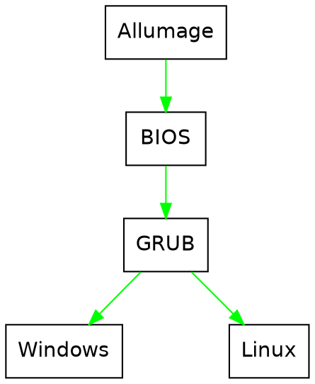

<style>
#doc>div, #doc>p, #doc>ul {
    text-align: justify;
}
</style>

Dual Boot like a pro!
===

## Avant le Dual Boot... Le Boot

### Commençons par un peu de vocabulaire

Lorsque vous appuyez sur le bouton power de votre ordinateur, le courant se propage instantanément à travers votre carte mère et ses différents composants, dont votre processeur, ou **CPU**. Seulement votre CPU est une machine à interpréter des instructions binaires, sous la forme
```
instruction paramètre-1 paramètre-2 ... pointeur-où-stocker-le-résultat-calculé
```
Il n'est donc pas vraiment *malin* et ne va pas __de lui-même__ inventer des instructions à interpréter pour se créer une structure mémoire cohérente, un environnement graphique etc. Il va donc avoir besoin d'un pré-programme, qui va lui servir sur un plateau les premières instructions dont il va avoir besoin pour prendre ensuite le relais et devenir autonome. Ce programme s'appelle le _Basic Input Output System_, ou __BIOS__. Le BIOS va donc chercher à certaines adresses mémoires bien précises, qui vont permettre de charger en mémoire tout un environnement compréhensible et pilotable par l'utilisateur, d'où son nom: _Operating System_, ou __OS__. Tout ce processus s'appelle le _boot_. C'est un enchaînement d'opérations critiques très bas niveau, qu'il est délicat de modifier, et c'est ce qu'on va détailler ici.

### Mais qu'est-ce que c'est un Dual Boot alors?

Un Dual Boot, c'est le fait d'avoir deux OS installés sur sa machine, et de pouvoir choisir entre les deux. Vous imaginez donc bien qu'on ne peut pas juste demander au BIOS de choisir entre deux sets d'instructions à envoyer au processeur au démarrage, c'est bien plus complexe que ça, d'où ce tutoriel.

:::success
Dans la suite, nous allons nous mettre dans la peau d'un utilisateur qui souhaiterait installer une distribution Linux à côté de son installation Windows.
:::


## Le BIOS et le choix des périphériques

Vous aurez peut être remarqué lorsque votre ordinateur démarre, généralement lorsque vous voyez un gros logo de la marque de votre ordinateur s'afficher, un petit message en bas à gauche de votre écran indiquant quelque chose comme ça:

```
Press <Esc> for BIOS, <F2> for boot menu
```
Les touches indiquées dépendent du [fabricant de la carte mère](https://www.tomshardware.com/reviews/bios-keys-to-access-your-firmware,5732.html) de votre ordinateur, qui est généralement le même qui a assemblé votre PC. 

:::info
Si aucune touche ne s'affiche, pas de panique! Il s'agit généralement de l'option _Fast Startup_ de Windows, qui lors de l'extinction de votre ordinateur, le plonge dans une espèce d'état hybride de veille très profonde. Pour accéder au BIOS, il vous faudra aller dans Windows et ensuite dans __Settings > Updates & Security > Recovery__ et cliquer sur l'option __Restart now__ en dessous de __Advanced Startup__. Au redémarrage, dans le menu qui s'affichera, faites __Troubleshoot > Advanced Options > UEFI Firmware Settings > Restart__ et vous devriez *enfin* avoir accès à votre BIOS :sunglasses: 
:::

En appuyant sur celle correspondant au BIOS, vous verrez s'ouvrir un menu, dans lequel vous pourrez modifier l'essentiel des paramètres que va utiliser le BIOS pour démarrer votre processeur et donc votre ordinateur. Ce sont généralement des paramètres assez avancés qui ne vont pas nécessairement vous intéresser, à quelques exceptions près:

- Les options de __priorité de boot__
- Le __secure boot__
- Les options concernant l'__USB__

Nous allons voir chacune de ces options une à une.

:::success
Pour les petits curieux qui voudraient savoir à quoi servent les autres options du BIOS : l'essentiel servent à définir comment votre BIOS va passer la main sur les périphériques à votre OS, et dans l'immense majorité des cas, vous n'aurez jamais à vous soucier de ces paramètres.
:::

<center>


</center>
    
_L'UEFI d'une carte mère GIGABYTE_

### Les priorités de boot

L'un des paramètres essentiel du BIOS, vous l'aurez peut être deviné, c'est le disque, ou plus généralement le système de stockage sur lequel il va aller chercher les premières instructions à envoyer à votre processeur. Comme pour un OS est fait pour surtout ne **jamais** modifier ces instructions-ci sur le disque où il est installé, nous allons devoir utiliser un périphérique externe, souvent une clef USB, ou un lecteur CD/DVD sur les plus vieilles machines, sur lequel le BIOS va faire booter l'ordinateur. Il va falloir alors venir sélectionner notre clef USB dans cette liste.

### Le secure boot

Cette option vise à protéger votre ordinateur contre des programmes pirates qui voudraient accéder à vos données. En effet, ceux qui ont déjà booté une clef d'installation Linux auront remarqué que l'on peut accéder à toutes les données du disque dur, et ce sans aucun mot de passe. Problématique si l'on travaille pour une entreprise qui possède des données sensibles non? C'est pourquoi il existe l'option _secure boot_ qui va, au démarrage de l'appareil, vérifier que le programme que le BIOS essaie de faire charger à l'ordinateur contient bien une clef de validation parmis une liste pré-déterminée par le fabricant de votre machine. Or, malgré des tentatives de nombreuses distributions Linux d'obtenir de telles clefs, certains fabricants restent réticents. Heureusement, il est très facile de désactiver une telle option, moyennant cependant généralement une petite manipulation. En effet, si n'importe qui pouvait désactiver cette option aussi facilement, cette sécurité serait inutile.

La méthode consiste en l'utilisation d'un __mot de passe__ pour accéder au BIOS. Mais je n'ai pas eu à taper de mot de passe, me direz vous. C'est normal, c'est à vous de le définir! L'idée étant que dans le cadre de données d'entreprise classées, le service IT définisse un tel mot de passe avant de vous passer cet ordinateur, pour être sûr que vous ne risquiez pas de faire de bêtises. En effet, une fois ce mot de passe défini, il vous faudra le renseigner à chaque fois que vous voudrez accéder au BIOS. Pour ce faire, vous trouverez dans l'onglet __security__ de votre BIOS un champ __Administrator's password__. Il vous suffit de le définir et de rebooter votre machine pour l'activer et accéder à votre BIOS avec les droits admin qui vous permettront de désactiver le _Secure boot_ (Attention: dans le BIOS votre clavier est certainement en QWERTY). Une fois votre dual boot terminé, vous pourrez aller retirer ce mot de passe (en laissant le champ vide).

:::info
Un mot de passe BIOS empêchera quelqu'un de booter sur une clef et d'accéder à vos données, mais pas de sortir votre disque de votre ordinateur, le brancher à un autre et accéder à vos données. Pour une sécurité plus complète, il vaut mieux __encrypter son disque__. Certaines distributions le proposent par défaut, mais il faut cependant noter que __ça ralentira considérablement le boot__ de votre ordi, du fait du décryptage.
:::

### Les options concernant l'USB

Il est possible que votre clef de boot n'apparaisse pas lorsque vous regardez vos priorités de boot. Deux causes possibles : 
- la première est que vous avez branché votre clef USB trop tard dans votre processus de boot, l'idéal étant de la brancher avant même d'appuyer sur le bouton d'alimentation. Rédémarrez votre ordinateur avec votre clef USB déjà insérée. 
- Si celle-ci n'apparaît toujours pas, c'est possiblement la deuxième possibilité: votre BIOS n'est pas configuré pour accepter les clefs USB. Il faut donc que vous le fouilliez pour trouver une option pour activer cette fontionnalité, probablement dans les onglets _Boot_ ou _Security_.

Il est possible que votre BIOS vous parle de _UEFI_ ou de _Legacy_, surtout si votre ordinateur est un peu vieux. Et ça tombe bien, c'est ce dont on parle juste après.

### Le _Legacy_ et le _UEFI_

La technologie du BIOS remonte aux années 70, et n'a que très peu évolué. C'est pourquoi il a fallu la moderniser en la remplaçant dans les années 2000 par le standard __UEFI__. L'ancien standard s'est donc logiquement fait renommer __Legacy__. Ici le choix est simple: si votre BIOS vous propose de choisir entre les deux, l'UEFI est plus moderne, plus sécurisé (notamment immunisé à certains malware), c'est donc même pas une question, **choisissez l'UEFI**. Si vous n'avez pas le choix et que vous voulez savoir quel est le standard de votre ordinateur, suivez [ce guide](https://itsfoss.com/check-uefi-or-bios/), mais globalement, si votre souris est active dans le BIOS, c'est forcément du UEFI, et si votre ordinateur se fait vraiment vieux, c'est probablement du Legacy.

<center>


</center>
    
_Choix du mode de boot_

:::info
Aujourd'hui, on regroupe indifféremment les BIOS et l'UEFI sour le terme __BIOS__
:::

### Et enfin: le boot

Une fois que vous avez réglé tout les détails nécessaires dans le BIOS, vous pouvez sauvegarder et redémarrer votre machine (en appuyant sur _F10_ généralement).

## Partitionnement, File System et Chargeur d'amorçage.

Houlala en voilà des nouveaux termes :face_with_one_eyebrow_raised: ! Ne vous inquiétez pas, on va tout détailler ensemble, pas à pas.
Sachez simplement qu'on passe à l'étape qui différencie le __n00b__ de l'installation Linux du véritable __haXX0r__ avec beaucoup de swagg: la préparation de votre disque. 
Si vous êtes très pressé et voulez entrer directement dans le vif, vous pouvez rendez vous dans [la partie suivante](#Préparation)

:::info
L'outil de partitionnement que j'utilise ici s'appelle __gparted__, et on le trouve sur l'essentiel des __lives USB__, sauf celles qui viennent avec KDE, sur lesquelles on trouve un équivalent: __partitionmanager__
:::


#### Le MBR et le GPT

Tout d'abord, votre disque dur, comme tout périphérique de stockage, peut être séparé en différents blocs de données indépendants, que l'on appelle des _partitions_, et qui se comporteront comme autant de disques durs du point de vue de votre OS. Pour connaître les partitions présentes sur votre disque, votre ordinateur va avoir besoin d'une sorte de carte pour savoir à quel endroit commencent et finissent __physiquemenent__ ces partitions sur votre disque. Cette carte s'appelle une _table de partition_. Il existe deux types de table de partition:

- Les tables de type _Master Boot Record_, ou __MBR__, que vous verrez parfois appelé aussi _ms-dos_ par les gestionnaires de partition Linux lors de vos installations. C'est un vieux standard assez capricieux, qui notamment ne gère pas les disques de plus de 2,2 To puisqu'il a été créé à une époque où cette quantité de stockage était complètement inimaginable. De plus, la table de partition n'est qu'en un seul exemplaire sur le disque, et s'il lui arrive quoi que ce soit, votre disque sera probablement définitivement perdu. Plus ennyueux, ce standard ne supporte que 4 partitions par disque, ce qui peut devenir vite limitant.

:::info
Pour y rémédier, il y a été créé une distinction entre les partitions de types _primaires_, et les partitions de type _extended_, qui sont grosso-modo des partitions de type primaires que l'on peut ensuite subdiviser en sous partitions, mais cela ne règle le problème que partiellement parce qu'il est recommandé de toujours installer son OS sur une partition de type primaire
:::

:::danger
Et __COMME PAR HASARD__, Windows se crée généralement une partition de données et __3__ partitions _soi-disant_ système, donc dans ce genre de configuration, il vous sera obligatoire de supprimer votre partition "recovery" par exemple
:::

- Les tables de type _Globally unique identifier Partition Table_, ou __GPT__ (ou encore _GUID_) sont le standard moderne, créé en même temps que l'UEFI, et qui règle ces problèmes en grande majorité: il gère plusieurs *exaoctets* de données, crée une copie de la table de partition au tout début et à la toute fin du disque, et permet d'avoir autant de partitions qu'on le souhaite.


_Création d'une nouvelle table de partition sous gparted_

:::info
Vous remarquerez qu'il y a __beaucoup__ plus de possibilités que juste _msdos_ et _gpt_. Cependant, l'essentiel de ces formats n'existe quasiment plus, ou est utilisé dans des cas extrêmement particuliers
:::

:::warning
Attention cependant, lorsque vous créez une nouvelle table de partition, il est courant que _gparted_ sélectionne _msdos_ par défaut, veillez bien à la passer en _gpt_
:::

#### Et moi, mon disque il est comment?

Si vous en êtes à l'étape du partitionnement de votre installation Linux, vous devriez pouvoir récupérer cette info dans l'utilitaire de partitionnement (sous gparted, __Affichage > Informations sur le périphérique__), mais généralement, si votre système est de type Legacy, votre table de partitionnement sera en MBR (il est quasiment impossible de faire fonctionner du GPT avec du Legacy), si votre système est en UEFI, votre table de partitionnement sera en GPT (le MBR marche très bien avec l'UEFI mais n'a quasiment que des inconvénients)


_Disque vierge avec une table de partition gpt_

:::warning
Et si j'ai un disque en MBR et que j'aimerais bien passer en GPT par commodité? Eh bien malheureusement, il est impossible de convertir un disque en MBR vers du GPT à moins de __l'effacer entièrement__. C'est pourquoi il faut faire attention à bien choisir sa table de partition lors du formattage de son disque.
:::

### Mais pourquoi partitionner?

Pour plein de raisons. Quand on fait une installation Linux, on peut tout à fait décider tout mettre dans une unique partition et puis c'est tout. Mais créer différentes partitions peut avoir de multiples avantage. Notamment, ces différentes parties sont considérées comme des disques durs indépendants par votre OS, ce qui permet de les préserver les unes des autres si l'on fait des fausses manip, de conserver ses données intact sans avoir à faire de laborieuses copies sur des disques durs externes lorsque l'on décide de changer de distribution, etc...

:::success
A l'ère des HDD, il existait une pratique qui consistait à créer une partition sur l'extérieur de son disque dur, c'est à dire la partie qui tourne le plus vite, et permettait de charger plus vite les logiciels installés dessus :female-student: 
:::

### Les formats de système de fichier

Lorsque vous créerez vos partitions, l'utilitaire de partitionnement vous demandera de choisir un système de fichier, ou _file system_. Il faut bien comprendre que votre disque dur, il va juste écrire des 0 et des 1 à des emplacements mémoires. Se pose alors la question, quand on crée un OS, de la façon dont on va enregistrer nos données, créer une arborescence de fichier, etc. Evidemment, tout le monde fait pas tout ça de la même façon. Si je viens voir dans votre chambre la manière dont vous avez rangé vos cours dans vos étagères, il y a de grande chances que ça soit différent de chez votre voisin. Ben là c'est pareil: __chacun son système de classement__. Il y a les _fat_ (_fat16_, _fat32_, _exfat_, _vfat_...) et le _ntfs_, créés par Microsoft, il y a le _hfs_ et le _hfs+_ créé par Apple, et comme sous Linux chacun développe son truc comme ça lui chante, il y en a toute une floppée, les plus classiques étant la famille des _ext_ (_ext2_, _ext3_, mais seul le _ext4_ est encore réellement utilisé), le _btrfs_, le _zfs_... Chacun apportant son lot d'avantages et d'inconvénients. Pour les débutants, je suggèrerais de se contenter de l'_ext4_ qui est une valeur sûre. Et pour ceux que ça intéresse, allez voir [ici](https://fr.wikipedia.org/wiki/Syst%C3%A8me_de_fichiers)


_Les différents systèmes de fichier proposés par gparted_

:::info
D'ailleurs, on est pas obligés d'utiliser un format "Linux" pour installer Linux. On peut très bien se faire un système de fichier en _ntfs_ par exemple... C'est jute très déconseillé, mais c'est possible... :see_no_evil: 
:::

#### Et le swap, c'est quoi?

Alors les plus observateurs auront remarqué le format de fichier appelé _linux-swap_. S'il y a Linux dans le nom, c'est que ça marche bien avec non? alors oui et non. En fait, le swap, c'est une invention de la communauté Linux, destinée aux vieux ordinateurs qui n'avaient que peu de mémoire vive. Basiquement, le principe d'une partition swap est qu'elle va être considérée par le système comme de la RAM (mémoire vive), et il va donc s'en servir comme tel. 

On pourrait se dire que si l'intérêt de la RAM par rapport au disque dur c'est la vitesse d'accès au données, ça sert à rien de la prolonger sur le disque dur. C'est vrai, mais ici la structure de donnée est pensée pour être accessible bien plus rapidement, et cela permet surtout de soulager la RAM lors des pics d'utilisation intensive. Ca ne fera pas de miracles, mais sur les vieilles configurations, cela peut faire une différence significative.

De plus, le swap offre une autre possibilié intéressante: la mise en hibernation. C'est une forme de mise en veille plus profonde: en effet votre OS va copier le contenu de votre RAM dans votre swap, et s'éteindre entièrement. Lors du redémarrage, le contenu de votre swap sera simplement re-transféré dans la RAM, et vous retrouverez votre ordinateur dans l'état où vous l'aurez laissé.

:::warning
Attention cependant si votre disque est un SSD. En effet, à limage des LEDs dont on compte la durée de vie en nombre d'allumages, on compte la durée de vie d'un SSD en nombre d'accès mémoire. Le swap pouvant augmenter fortement ces derniers, il se peut que vous accélériez le vieillissement de votre SSD. Beaucoup le font, mais c'est à vos risques et périls.
:::

### Le chargeur d'amorçage

En voilà un gros morceau. Vous vous souvenez du rôle du BIOS? Il envoie au processeur les premières instructions dont il a besoin pour charger un OS entier, et être autonome. Mais si notre objectif ici est de créer un Dual Boot, comment demander au BIOS de nous laisser choisir quel OS démarrer si on en a deux installés? Une solution serait d'installer chaque OS sur un disque dur séparé, puis de choisir sur lequel booter au démarrage. C'est envisageable, mais ça suppose d'appuyer à chaque démarrage sur la touche de menu de boot, de connaître le matricule un peu barbare de chaque disque et de savoir quel OS est installé sur lequel, mais surtout, ça suppose d'avoir deux disques durs dans son ordinateur! Autant dire que ce n'est pas évident. C'est ici qu'intervient le chargeur d'amorçage. Au démarrage, le BIOS va lui passer la main, et celui-ci va pouvoir afficher un petit menu dans lequel vous allez pouvoir choisir sur quel OS booter. C'est beaucoup plus esthétique en plus d'être une solution beaucoup plus propre.
Il en existe beaucoup, les plus connus étant __GRUB__ (plus précisément __GRUB2__) et __rEFInd__. Linux fonctionne évidemment avec les deux, mais installe par défaut GRUB, qui est très poussé et fonctionne parfaitement dans l'écrasante majorité des cas.



_Séquence de démarrage d'un ordinateur_

:::info
En fait, le chargeur d'amorçage fait bien plus que ça: il charge différents programmes nécessaires pour lancer votre OS. C'est pour ça que Windows a aussi son propre chargeur d'amorçage, bien qu'il ne permette pas de choisir quel OS booter, et que les distributions Linux installent systématiquement GRUB, même s'il n'y a pas d'autre OS: le chargeur d'amorçage est __nécessaire__. De manière générale, ce schéma est limité et le processus de boot est plus complexe, mais on s'en contentera ici :face_with_monocle: 
:::

Pourquoi mentionner le chargeur d'amorçage ici? Parce que généralement, il est installé sur la même partition que votre distro (distribution). Donc si par un bricolage maladroit (genre en copiant/collant une commande sans savoir ce qu'elle fait), vous bousillez votre install, vous ne pourrez plus accéder à Windows non plus, même s'il va très bien. Il est donc de bonne pratique de créer une petite partition en début de disque pour l'installer dessus.

## 3... 2... 1... Dual Boot!

### Tant qu'on est sur Windows...

#### Le media d'installation

Ou sur Linux, peu importe, mais avant de se lancer, il vous faudra préparer un __media d'installation__ ou __Live CD/USB__. Pour cela vous aurez besoin:

- D'une __clef USB__ de minimum 4Go __vierge__ (tout les fichiers seront effacés dans le process)
- D'un fichier __.iso__ que vous aurez téléchargé sur le site officiel de votre distribution préférée (cf le [tuto](https://markdown.data-ensta.fr/s/ypPSr0ZLm#) sur choisir sa distribution)
- D'un logiciel de __création de média bootable__ (Sous Windows, _[Ventoy](https://www.ventoy.net/en/doc_start.html)_ ou _[Rufus](https://rufus.ie/fr/)_, sous Linux, _Startup Disk Creator_ installé par défaut sous Ubuntu, ou _Image Writer_, à télécharger dans votre logithèque)

Le process est très simple et généralement assez guidé sur les sites officiels des logiciels de création de média bootable: vous insérez la clef USB, lancez le logiciel, réglez 2 - 3 paramètres si nécessaire, puis lancez l'installation, ça prend quelque minutes , et puis on est partis, votre média est prêt plus vite que vos nouilles instantanées. :checkered_flag:

:::danger
Attention à bien sélectionner votre clef USB dans votre logiciel de création de média. Normalement vous ne devriez pas pouvoir écraser votre disque dur avec, mais vous pourriez effacer par inadvertance le contenu d'un autre périphérique branché à votre PC
:::

:::info
Spoiler alert: à DaTA il y a des tonnes de clefs USB déjà toute prêtes :floppy_disk: 
:::

#### La partition windows

Une fois votre clef USB prête, il vous faudra libérer de la place pour vos nouvelles partitions. Pour cela, rendez-vous dans l'utilitaire de disque de Windows (__clique droit sur l'icône de menu > gestionnaire de disques__). Vous y verrez votre partition __C:__ indiquée, et il vous faudra la réduire d'autant que l'espace que vous voudrez libérer pour votre installation Linux (__clique droit sur la partition > réduire le volume__). Si il refuse de réduire au delà d'un certain seuil alors que vous avez en théorie beaucoup de place disponible, il vous faudra __défragmenter votre disque__ avant de recommencer l'opération (Ah, les joies du NTFS...). Si le seuil que vous atteignez maintenant ne vous convient toujours pas, libre à vous de faire votre réduction directement depuis votre live USB, mais il est possible que vous abîmiez quelques fichiers au passage (normalement rien de grave, mais à vos risques et périls)

#### Le BIOS

Si vous avez bien tout suivi au début du tutoriel, rien de bien compliqué: désactivez _secure boot_, activez le boot sur USB, et bootez sur votre USB avec le mode (Legacy / UEFI) qui convient.


### Et maintenant, partitionnement.


Une fois que votre BIOS est configuré comme il faut, vous devriez **booter sur votre clef USB**. Mais qu'est-ce que ça veut dire exactement ? Et bien si vous avez bien compris tout ce que j'ai expliqué plus haut, c'est à la fois simple et un petit bijoux de technologie: votre BIOS va envoyer à votre processeur les instructions écrite sur votre clef USB et __booter un OS complet__ à partir de celle-ci. Jusqu'au milieu des années 2010, les différentes distributions arrivaient même à faire tenir tout ça sur les 700 Mo d'un CD.

Et cet OS va avoir deux utilités: d'une, avoir toute les fonctionnalités nécessaires pour se copier et s'installer sur votre disque dur, et d'autre part vous permettre de tester ce dernier avant de vous décider.

Une fois décidé, les processus d'installation des distributions Linux sont tous plus ou moins identiques et tout à fait instinctifs, à un ou deux détails près, que nous allons détailler ici.

Maintenant que vous êtes booté sur votre clef USB, ne choisissez pas l'option d'installation, mais l'option d'essai, pour tester la distribution. Là, lancez __GParted__ ou l'utilitaire de partitionnement de votre distribution, et vous êtes prêts à faire l'installation la plus propre de votre vie.

:::warning
La plupart des opérations suivantes peuvent généralement être faites depuis l'installateur de votre distribution, mais il est plus propre de le faire de la façon suivante. Si votre dévolu s'est porté sur __Debian__ ou un de ses dérivés directs (comme __Kali__), vous n'aurez pas accès à l'environnement _live_ de test, et serez obligés de partitionner depuis l'installeur. Ou alors il faudra commencer par booter sur une clef __Ubuntu__ par exemple, pour préparer votre disque.
:::

### Partitionner son disque

#### Pour un dual boot

En avant pour le Dual Boot! Mais maintenant qu'on sait tout ça, comment on procède? Si vous avez bien suivi le tutoriel jusqu'ici, vous devriez voir un layout (affichage) qui ressemble un peu à ça:


_Partitionnement avant l'installation de Linux_


Et bien voilà le genre de layout que l'on va vouloir obtenir dans notre cas:


_Layout recherché pour un Dual Boot en GPT_


:::info
Il est probable que vous ayez deux ou trois partitions Windows au lieu d'une. Si vous êtes en GPT, ce n'est pas un problème. En MBR, vous allez devoir faire des choix. Je vous suggère de privilégier la partition root (obligatoire) s'il ne reste qu'une partition primaire à créer, et le swap s'il y en a deux. S'il y en a trois, créez une partition logique avec la partition root et la partition home, puis un swap et le boot.
:::

En MBR, voilà ce que vous allez chercher à faire:


_Layout recherché pour un Dual Boot en MBR_

Les noms sont assez explicites, mais nous allons les détailler ensemble.

- Tout d'abord, une partition de boot, de 512 Mo, c'est largement suffisant, sur laquelle nous allons installer le chargeur d'amorçage. Elle __doit__ être en _fat32_ pour fonctionner.
- Une partition root, sur laquelle nous allons installer notre distribution et nos logiciels. Vous pouvez lui donner la taille et le format que vous souhaitez, mais je recommande de ne pas descendre en dessous de 20 Go, 50Go étant confortables. Je ne saurais que vous recommander le _ext4_ pour une partition Linux, mais libre à vous.
- Une partition home, sur laquelle nous allons mettre nos fichiers personnels. Si vous êtes amateur de séries et de films, je vous suggère d'y mettre directement plusieurs centaines de Go, ils seront vite remplis. Pour le format, je vous suggère _ext4_ car il comporte de nombreux avantages. Mais si vous voulez pouvoir y accéder depuis Windows, le _ntfs_ sera votre choix, bien que je ne le recommande pas.
- Enfin une partition swap, surtout si vous avez un HDD et 8Go de RAM ou moins. En ce cas, mettez autant de _swap_ que vous avez de RAM.

:::danger
Réfléchissez bien à la __taille__ que vous voulez donner à vos partitions, car si elles sont en théorie toujours modifiables après coup, en pratique __vous risquez de perdre des données__ et autres petits ennuis.
:::

:::info
L'idéal est de mettre le boot au tout début du disque, et le swap à la toute fin. Cependant, Windows occupe généralement tout le début du disque, et s'il est facile de déplacer la __fin__ d'une partition, en déplacer le __début__ est très laborieux et sujet à des pertes de données: il faut déplacer tout les bits un à un d'un point à un autre de votre disque. C'est très long, et surtout, pas question de l'interrompre: vous perdriez quantité de données. Donc ne le faites que si vous êtes sûrs de vous.
:::

:::success
Je ne peux vraiment pas accéder à du _ext4_ depuis Windows? Alors vous y arriverez __peut être__ avec le projet [Ext2Fsd](https://en.wikipedia.org/wiki/Ext2Fsd), mais si c'était un remède miracle, ça se saurait...
:::

#### Pour une installation de Linux seul

Lorsqu'on fait une installation de Linux seule sur son disque dur, voici le genre de layout que l'on va viser:


_Le layout classique d'une installation Linux_

Il est identique au layout précédent, à ceci près que l'on a pu ici mettre le boot au début et le swap à la fin. 

:::danger
N'oubliez pas de cliquer sur __Appliquer toutes les modifications__ après avoir préparé votre layout dans GParted. En effet, il ne modifie pas votre table de partition en live (vous imaginez le bordel?), il faut donc valider les changements pour les appliquer.
:::

---
Maintenant que votre disque est prêt, on peut reprendre notre installation. Les étapes s'enchaînent bien, jusqu'à ce que votre distribution vous demande le type d'installation que vous souhaitez. Le partitionnement manuel sera généralement sous le nom _autre_ ou _personnalisé_.


_Type d'installation sous Ubuntu_

Vous arrivez alors sur une fenêtre qui vous liste l'ensemble des partitions:


_Liste des partitions que l'on a préparé_

On les identifie facilement. On va commencer par changer le _périphérique où sera installé le programme de démarrage_ à notre partition de boot, ici _/dev/sda4_. Puis on va venir sélectionner chacune des partitions, cliquer sur _modifier_, et lui attribuer les propriétés souhaitées:

<center>

|           | Utiliser comme                                 | Point de montage |
| --------- | ---------------------------------------------- | ---------------- |
| /dev/sda2 | Système de fichers journalisés ext4            | /                |
| /dev/sda3 | Système de fichers journalisés ext4            | /home            |
| /dev/sda5 | Espace d'échange ("swap")                      |                  |
| /dev/sda4 | Zone réservée pour le chargeur d'amorçage BIOS |                  | 

    
</center>


Voilà à peu près ce que vous devriez obtenir, à adapter en fonction du nom de vos partitions évidemment.

:::success
Il est à noter que les partitions ne sont pas nécessairement sur le même disque! C'est même recommandé lorsque vous possédez un petit SSD et un gros HDD: installez votre partition _root_ sur votre SSD, pour que tout vos programmes démarrent rapidement, et votre partition _home_ sur votre HDD pour avoir plein de place pour vos films, jeux et autre
:::

---

Voilà! Votre Dual Boot est fait.

## Pourquoi avoir fait un tuto aussi long juste pour ça?

Si on avait voulu juste apprendre à faire bêtement un Dual Boot, booter l'USB et cliquer sur _Suivant_ sans réfléchir aurait suffit. Et c'est d'ailleur admirable qu'on arrive à simplifier le processus d'une distro à ce point. Mais en faisant tout ce que l'on a écrit ci-dessus, avec un peu de chance, vous aurez appris de nouvelles choses sur le fonctionnement d'un ordinateur et de Linux, et peut être même que vous aurez compris ce que vous avez fait. Alors, l'objectif est atteint. Parce que la philosophie de Linux, c'est pas de l'utiliser, c'est de le comprendre. 

---